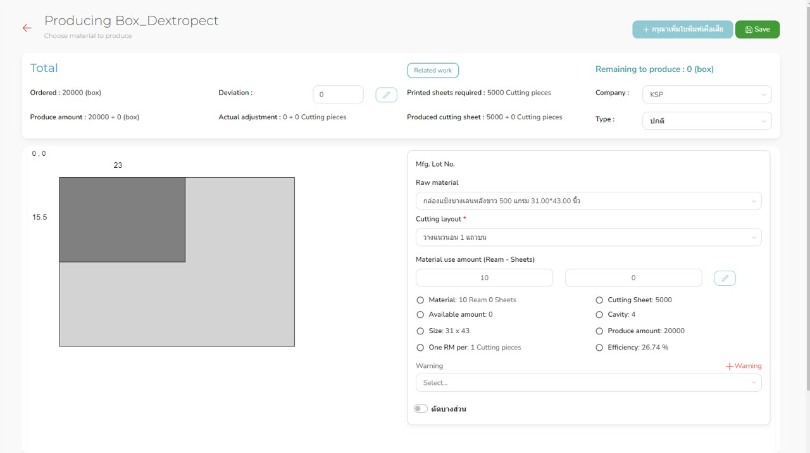

The test is intended to check full-stack developer qualifications, with an emphasis on improving software component design, quality, and performance. Please answer the following questions:
 
1. [10 points] From the image below,
   
   
Please listen carefully to the explanation and answer the following questions:
   
   -- How you can manage the layout of small rectangle on large rectangle between back-end and front-end?

   -- How you can manage the calculation between top and lower left panel?

3. [10 points] Give 5 causes that introduce performance issue to Node.js and explain how to solve each of them.
